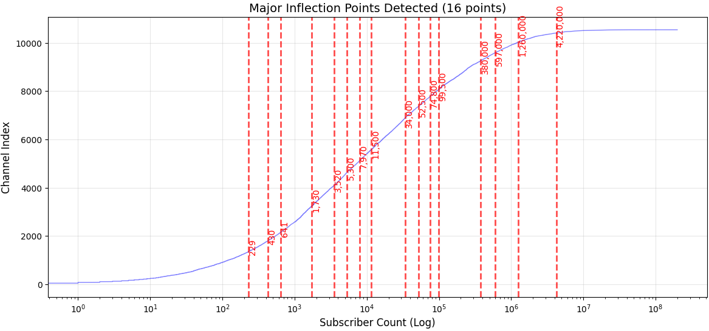
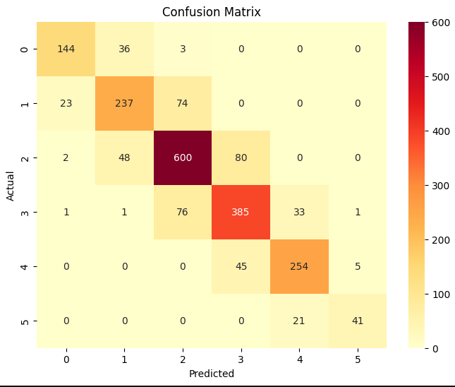
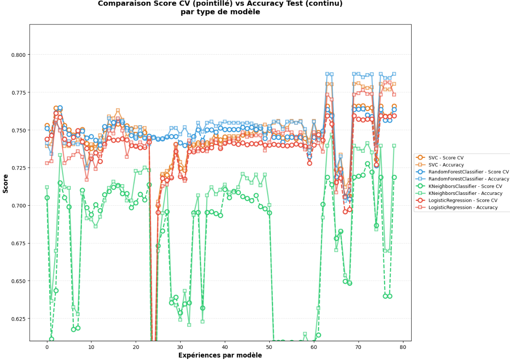

# 📺 YouTube Edu-Analytics: A Full-Stack Machine Learning Pipeline

## 🚀 Project Overview
This project implements a complete end-to-end Data Science pipeline designed to discover, extract, and categorize educational YouTube channels. Using a data-driven approach, we analyze high-volume metadata to predict a channel's growth category through various Machine Learning classifiers.

## 📊 Big Data Scale & Robustness
The models are trained on a high-density dataset, ensuring statistically significant results and robust generalization:
* **Total Video Metadata**: ~490,000 records.
* **Unique Channels Analyzed**: 10,600 educational creators.
* **Domains Analyzed**: 90 distinct academic and technical niches.
* **Statistical Depth**: The massive volume of data allowed for precise **Inflection Point Analysis**, making the "separation zones" between growth categories mathematically distinct and clear.

### Channel Distribution by Log(Subscribers)
Below is the distribution curve showing the inflection points that defined our 6 data-driven categories.

## 🛠️ Pipeline Architecture
The project is structured into four specialized notebooks:
1. **`01_Automated_Channel_Discovery.ipynb`**: Automated discovery of channel IDs across 90 educational domains using the YouTube API.
2. **`02_High_Throughput_Video_Extraction.ipynb`**: Mass extraction of video metadata using **Python ThreadPoolExecutor** for high-speed parallel processing.
3. **`03_Data_Wrangling_and_Feature_Engineering.ipynb`**: 
    * Processing and cleaning of 490k records.
    * **Feature Engineering**: Calculating publishing regularity (CV), engagement metrics, and channel age.
    * **Statistical Binning**: Defining 6 growth classes based on logarithmic inflection points (Bins: 0, 1000, 1k, 20k, 200k, 2M,+2M).
4. **`04_Predictive_Modeling_and_Classification.ipynb`**: Comparative evaluation of multiple classifiers including SVC, Random Forest, KNN, and Logistic Regression.

## 🏆 Model Performance
The models were tasked with classifying channels into 6 growth stages. The **Random Forest Classifier** provided the highest overall accuracy.

| Model | CV Score (Mean) | Test Accuracy |
| :--- | :---: | :---: |
| **Random Forest** | 0.7636 | **78.72%** |
| **SVC (RBF Kernel)** | **0.7656** | 0.7806 |
| **Logistic Regression** | 0.7594 | 0.7735 |
| **K-Nearest Neighbors** | 0.7185 | 0.7393 |

### Confusion Matrix (Random Forest)
Our best-performing model (Random Forest, 78.72%) shows high precision in identifying established channel categories, which is vital for targeting content creators with significant influence.

## 📈 Model Optimization & Experiments
To find the best performing parameters for each algorithm, multiple experiments were run. The plot below illustrates the evolution of Cross-Validation scores (dotted lines) versus Test Accuracy (solid lines) during the hyperparameter tuning phase for all four models.

> **Key Takeaway**: We can observe consistent and strong performances from **Random Forest** (light blue line) and **SVC** (orange line) across most trials. The tight relationship between their validation (dotted) and test (solid) scores demonstrates robust generalization.

---

## 💡 Key Findings
* **Feature Importance**: Metrics like "Publishing Regularity" and "Engagement-per-video" are superior predictors of a channel's category compared to simple total upload counts.
* **Model Stability**: The minimal gap between Cross-Validation scores (76.56%) and Test Accuracy (78.72%) confirms the quality of the engineered features and the absence of overfitting.

## ⚖️ License
This project is licensed under the **MIT License**.
